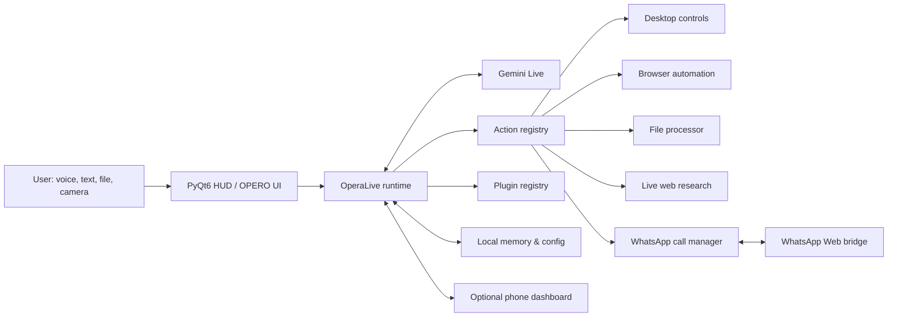
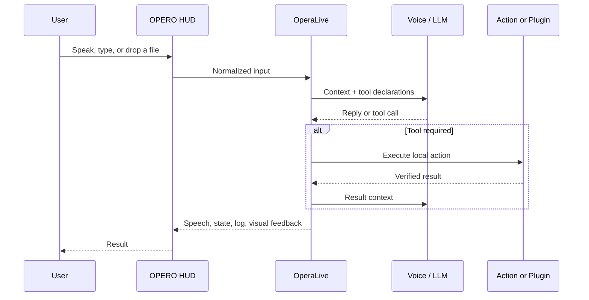
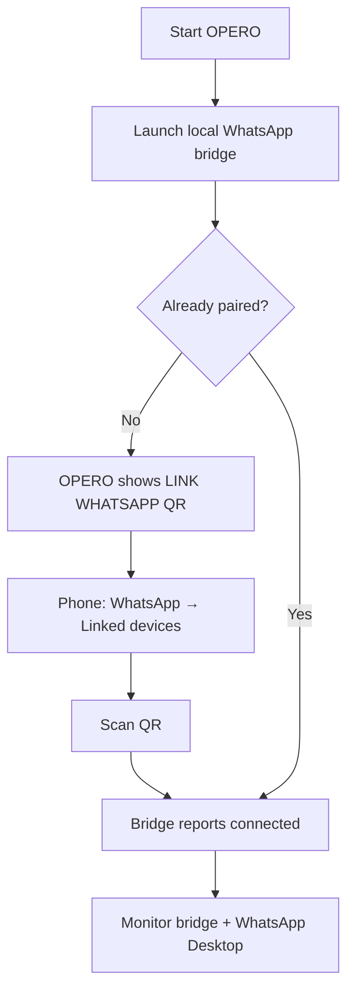
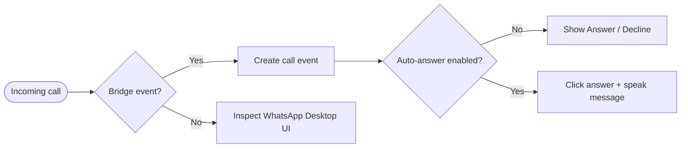

<div align="center">

# ◈ OPERO

### _A native voice-first desktop operator_

`VOICE` · `VISION` · `AUTOMATION` · `LOCAL CONTROL`


<sub>OPERO listens, reasons, acts, and reports the verified result.</sub>

[**GET STARTED**](#-quick-start) · [**CAPABILITIES**](#-capabilities) · [**ARCHITECTURE**](#-system-architecture) · [**DEVELOPMENT**](#-development) · [**WHATSAPP**](#-whatsapp-call-assistant)

</div>

```text
┌─────────────────────────────────────────────────────────────────────────────┐
│  OPERO // DESKTOP OPERATOR                                      STATUS: READY │
│  INPUT  voice · text · file · camera       OUTPUT  speech · UI · local action │
│  CORE   Gemini Live · AssemblyAI · Playwright · PyQt6 · local tool registry   │
└─────────────────────────────────────────────────────────────────────────────┘
```

> [!IMPORTANT]
> OPERO is designed to act, not merely describe how to act. It keeps consequential work visible and stops for review before final submissions or irreversible external actions.

---

## ◈ // WHY OPERO

Most assistants stop at advice. OPERO is designed to turn a spoken or typed request into an observable desktop result: opening an app, researching current information, processing a file, controlling a browser, preparing an application, or routing a voice interaction through a visual HUD.

OPERO is a **local desktop application**. Its interface, audio devices, files, browser automation, and WhatsApp Desktop controls remain on the machine. Cloud services are used only for capabilities you configure, such as Gemini or AssemblyAI.

---

## ◈ // QUICK START

### Prerequisites

| Requirement | Needed for | Notes |
| --- | --- | --- |
| Python 3.11–3.13 | Core application | Python 3.12 is recommended |
| Gemini API key | Default live voice experience | Enter on first launch or in OPERO settings |
| Node.js 18+ | WhatsApp bridge | Required only for WhatsApp pairing/call detection |
| Chrome or Edge | WhatsApp bridge runtime | The bridge discovers installed browsers; use `WA_CHROME_PATH` to override |

### Install

```powershell
git clone <your-repository-url>
cd "The Opero"
python setup.py
```

### Start

```powershell
python main.py
```

On first launch, OPERO guides you through API key configuration. All secrets stay local — `config/api_keys.json` is gitignored by default.

### Run Tests

```powershell
pip install -e ".[dev]"
python -m pytest tests/ -v
```

---

## ◈ // CAPABILITIES

| Capability | Typical request | Outcome |
| --- | --- | --- |
| Live web research | "Find internships matching my Python and AI experience." | Current links, ranked options, concise comparison |
| Application preparation | "Use my resume to fill this internship form." | Extracts details and fills fields; pauses before submission |
| Desktop control | "Set this image as my wallpaper." | Applies a local image or downloads a URL-based wallpaper |
| File processing | "Summarize this PDF" / "Convert this spreadsheet." | Reads, analyzes, transforms, or exports supported files |
| Vision | "What is on my screen?" | On-demand screen or camera analysis |
| Browser operation | "Open the docs and find the API section." | Browser navigation and page interaction |
| Call assistance | "Answer WhatsApp calls and say I'm busy." | QR pairing, bridge detection, and Desktop-call handling |
| Mini mode | Press F10 or click ◱ | Small draggable avatar widget (cat, face, emoji, Spider-Man) |
| Voice engines | Switch between Gemini Live and AssemblyAI | Real-time voice with multiple STT/TTS backends |
| Plugin system | Drop a Python file in `plugins/` | Auto-discovered, hot-loadable, with enable/disable |

> [!NOTE]
> **Operator rule:** OPERO reports verified tool results — it never claims an action occurred when it did not.

---

## ◈ // SYSTEM ARCHITECTURE



### Voice and action lifecycle



---

## ◈ // REPOSITORY MAP

```text
opero/
├── main.py                 # Entry point, OperaLive session, audio pipeline
├── ui.py                   # PyQt6 HUD, overlays, Automation Studio
├── whatsapp_call.py        # Bridge coordination and Desktop call detection
├── whatsapp_bridge/        # Node.js WhatsApp Web bridge and QR endpoint
│
├── core/                   # Voice, audio, vision, infrastructure
│   ├── gemini.py           # Gemini Live API client with model fallback
│   ├── llm_client.py       # Local LLM support (Ollama, OpenAI-compatible)
│   ├── action_loader.py    # Tool discovery, validation, and dispatch
│   ├── validator.py        # Input validation for tool parameters
│   ├── echo.py             # Content-based echo cancellation
│   ├── viseme.py           # Lip-sync viseme generation
│   ├── tts.py              # Multi-engine TTS (EdgeTTS, Kokoro, ElevenLabs)
│   ├── stt.py              # Multi-engine STT (Whisper, Vosk)
│   ├── wake_word.py        # Local "Hey opero" wake word detection
│   ├── confirm.py          # Human confirmation gate (forge-resistant token)
│   ├── logger.py           # Centralized logging configuration
│   ├── installer.py        # Auto-dependency installer
│   ├── avatar.py           # Avatar rendering (holographic orb)
│   └── prompt.txt          # AI behavior specification
│
├── actions/                # Self-registering tool modules (21+)
│   ├── browser_control.py  # Search, navigate, screenshot, form fill
│   ├── send_message.py     # WhatsApp, email, messaging
│   ├── file_ops.py         # Read, write, move, copy, delete
│   ├── computer_control.py # System commands, app control
│   ├── code_helper.py      # Code analysis and generation
│   ├── dev_agent.py        # Development task automation
│   └── ...                 # weather, reminders, flight finder, etc.
│
├── memory/
│   ├── config_manager.py   # Settings persistence (JSON + AES encryption)
│   └── memory_manager.py   # Long-term memory with search
│
├── dashboard/              # Local HTTP dashboard (FastAPI + WebSocket)
├── plugins/                # Drop-in extensions with hot-load
├── config/                 # Runtime config (gitignored)
├── tests/                  # Test suite (84 tests, pytest)
├── pyproject.toml          # Modern Python packaging
└── CONTRIBUTING.md         # Development guide
```

---

## ◈ // SYSTEM MAP

| Area | What OPERO provides | Primary component |
| --- | --- | --- |
| Voice | Gemini Live conversation, interruption, push-to-talk, wake word | `main.py`, `core/session.py` |
| Alternative voice | AssemblyAI streaming STT with TTS output | `core/assemblyai_voice.py` |
| Desktop | App launch, wallpaper, file tasks, system controls | `actions/` |
| Browser | Search, navigation, page reading, screenshots | `actions/browser_control.py` |
| Files | Documents, PDFs, images, spreadsheets, audio, video | `actions/file_processor.py` |
| WhatsApp | QR pairing, bridge events, call detection | `whatsapp_call.py`, `whatsapp_bridge/` |
| Automation | Visual trigger → logic → action maps | `ui.py` Automation Studio |
| Remote access | Optional phone dashboard with encrypted pairing | `dashboard/` |
| Mini mode | Draggable avatar widget (4 styles) | `ui.py` MiniModeWidget |
| Extensibility | Auto-discovered actions and plugins | `core/action_loader.py`, `plugins/` |

---

<a id="development"></a>
## ◈ // DEVELOPMENT

### Setup

```powershell
git clone <repo-url> && cd "The Opero"
python -m venv .venv
.venv\Scripts\activate          # Windows
pip install -e ".[dev]"
```

### Code Quality

```powershell
# Run all tests
python -m pytest tests/ -v

# Lint
ruff check .

# Type check
mypy .
```

### Adding a New Action

1. Create `actions/my_action.py`
2. Define a `TOOL` dict (name, description, JSON Schema parameters)
3. Optionally add a `VALIDATOR` dict for input validation
4. Implement `execute(params: dict) -> str`
5. The action is auto-discovered on next startup

```python
# actions/example.py
from core.logger import get_logger
from core.validator import validate_params

log = get_logger(__name__)

TOOL = {
    "name": "example_action",
    "description": "Does something useful",
    "parameters": {
        "type": "object",
        "properties": {
            "query": {"type": "string", "description": "What to search for"},
        },
        "required": ["query"],
    },
}

VALIDATOR = {
    "query": [{"type": str, "required": True, "max_len": 500}],
}

def execute(params: dict) -> str:
    params = validate_params(params, VALIDATOR, "example_action")
    log.info("Running example_action with query=%s", params["query"])
    return f"Result for: {params['query']}"
```

### Adding a Plugin

Drop a Python file in `plugins/` following the template in `plugins/_template.py`. Plugins are hot-loaded — enable/disable without restart.

---

<a id="whatsapp-call-assistant"></a>
## ◈ // WHATSAPP CALL ASSISTANT

### Pairing flow



1. Start OPERO
2. Click **💬 LINK WHATSAPP** in the controls drawer (or wait for auto-prompt)
3. On your phone: **WhatsApp → Settings → Linked devices → Link a device**
4. Scan the QR code shown inside OPERO
5. Keep WhatsApp Desktop open for automated call controls

### Incoming call flow



> [!WARNING]
> WhatsApp does not provide a public API for personal calls. OPERO uses a linked local session and Desktop UI automation, which must be tested on your machine.

---

## ◈ // VOICE ENGINES

| Engine | Use case | Setup |
| --- | --- | --- |
| Gemini Live | Low-latency bidirectional voice + native tool use | Configure Gemini key, choose a voice |
| AssemblyAI | Real-time transcription with alternate pipeline | Add `assemblyai_api_key`, switch engine in UI |

If AssemblyAI fails, OPERO falls back to the default engine automatically.

---

## ◈ // LOCAL CONFIGURATION

Configuration is stored at `config/api_keys.json` (gitignored):

```json
{
  "gemini_api_key": "",
  "assemblyai_api_key": "",
  "voice_engine": "opero",
  "whatsapp_auto_answer": false,
  "whatsapp_busy_message": "I am busy right now.",
  "moss_user_id": "123456"
}
```

---

## ◈ // TROUBLESHOOTING

| Symptom | Fix |
| --- | --- |
| Browser actions fail | Run `python -m playwright install chromium firefox` |
| AssemblyAI falls back | Re-enter API key and check microphone selection |
| QR panel never appears | Run `npm install` in `whatsapp_bridge/`, check Node.js |
| Caller hears nothing | Configure virtual audio device as WhatsApp's microphone |
| MOSS rejects submission | Use the numeric ID from Stanford MOSS registration |

---

## ◈ // SECURITY & RESPONSIBLE USE

- API keys, OAuth tokens, and WhatsApp sessions stay on your machine (`config/` is gitignored)
- Review recipients, form fields, and submissions before they leave your machine
- Dashboard is localhost-only with CORS, rate limiting, and security headers
- All tool parameters are validated before execution
- Human confirmation gate prevents irreversible actions

## ◈ // LICENSE

See [LICENSE](LICENSE).
