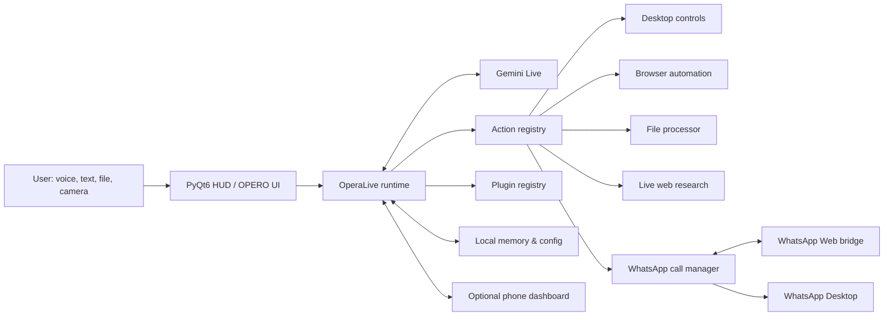
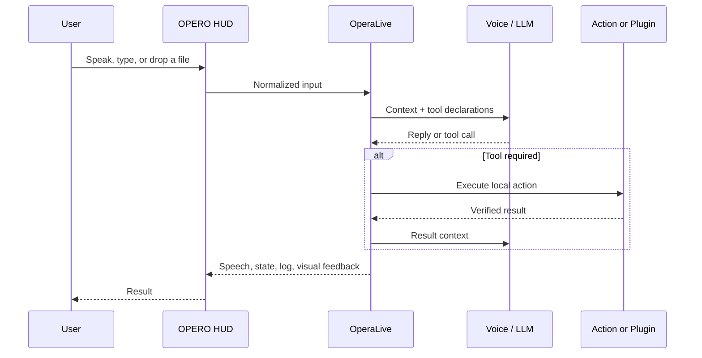
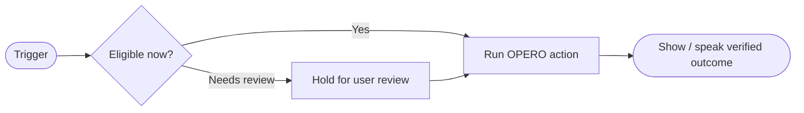
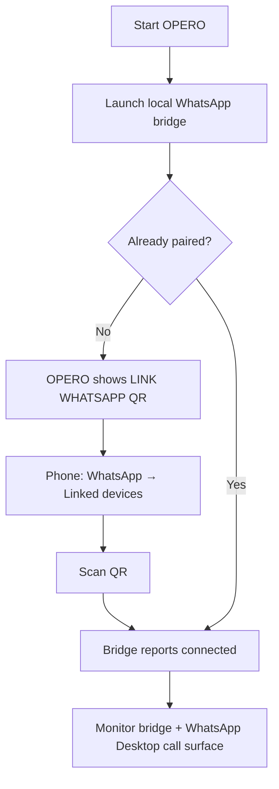
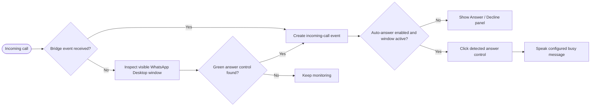
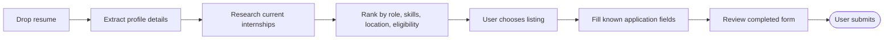

# OPERO

<p align="center">
  <strong>A native, voice-first desktop operator that can reason, see, speak, automate, and report back.</strong><br />
  Built with PyQt6, Gemini Live, AssemblyAI, Playwright, and local desktop controls.
</p>

<p align="center">
  <a href="#quick-start">Quick start</a> · <a href="#capabilities">Capabilities</a> · <a href="#whatsapp-call-assistant">WhatsApp</a> · <a href="#automation-studio">Automation Studio</a> · <a href="#demo-runbook">Demo</a>
</p>

---

## Why OPERO

Most assistants stop at advice. OPERO is designed to turn a spoken or typed request into an observable desktop result: opening an app, researching current information, processing a file, controlling a browser, preparing an application, or routing a voice interaction through a visual HUD.

OPERO is a **local desktop application**. Its interface, audio devices, files, browser automation, and WhatsApp Desktop controls remain on the machine. Cloud services are used only for capabilities you configure, such as Gemini or AssemblyAI.

## At a glance

| Area | What OPERO provides | Primary component |
| --- | --- | --- |
| Voice | Gemini Live conversation, interruption, push-to-talk, wake word, animated speech feedback | `main.py`, `ui.py` |
| Alternative voice stack | AssemblyAI streaming STT with TTS output | `core/assemblyai_voice.py` |
| Desktop | App launch, wallpaper, file tasks, common system controls, screen/camera assistance | `actions/` |
| Browser | Search, navigation, page reading, form filling, screenshots, tab control | `actions/browser_control.py` |
| Files | Documents, PDFs, images, spreadsheets, audio, video, archives, and code | `actions/file_processor.py` |
| WhatsApp | QR pairing, bridge events, visible Desktop-call detection, answer/decline flow | `whatsapp_call.py`, `whatsapp_bridge/` |
| Automation | Visual trigger → logic → action maps for core OPERO flows | `ui.py` |
| Remote access | Optional phone dashboard with encrypted pairing | `dashboard/` |
| Extensibility | Auto-discovered actions and plugins | `core/action_loader.py`, `plugins/` |

## Capabilities

| Capability | Typical request | Outcome |
| --- | --- | --- |
| Live web research | “Find internships matching my Python and AI experience.” | Current links, ranked options, concise comparison |
| Application preparation | “Use my resume to fill this internship form.” | Extracts known details and fills fields; pauses before final submission |
| Desktop control | “Set this image as my wallpaper.” | Applies a local image or downloads and retains a URL-based wallpaper |
| File processing | “Summarize this PDF” / “Convert this spreadsheet.” | Reads, analyzes, transforms, or exports supported files |
| Vision | “What is on my screen?” | On-demand screen or camera analysis |
| Browser operation | “Open the docs and find the API section.” | Browser navigation and page interaction |
| Call assistance | “Answer WhatsApp calls and say I’m busy.” | Optional QR pairing, bridge detection, and Desktop-call handling |
| Code similarity | “Run MOSS on this submissions folder.” | Submits authorized source code and returns a MOSS report link |

> OPERO should report verified tool results, not claim an action occurred when it did not.

---

## System architecture



### Voice and action lifecycle



## Automation Studio

Open **⚙ Controls → Automation Studio** to inspect OPERO’s node-based workflow maps. It follows the actual operating model: a trigger enters a decision stage, eligible actions run, and consequential steps pause for review.



| Flow | Trigger | Nodes shown | Boundary |
| --- | --- | --- | --- |
| WhatsApp busy reply | Incoming call | Detect → auto-answer window → answer Desktop → speak message | Requires pairing, visible Desktop, and tested audio route |
| Internship application | Resume uploaded | Extract → research → rank → fill → review | OPERO never makes the final submission itself |
| Smart reminder | Reminder due | Trigger → availability check → alert | Uses configured reminder pathway |
| Desktop command | Voice or typed intent | Resolve tool → run action → report result | Requires an available local action |

---

## Quick start

### Prerequisites

| Requirement | Needed for | Notes |
| --- | --- | --- |
| Python 3.11–3.13 | Core application | Python 3.12 is supported in development |
| Gemini API key | Default live voice experience | Enter on first launch or in OPERO settings |
| Node.js 18+ | WhatsApp bridge | Required only for WhatsApp pairing/call detection |
| Google Chrome or Microsoft Edge | WhatsApp bridge runtime | The bridge discovers installed Chrome/Edge; use `WA_CHROME_PATH` to override |
| WhatsApp Desktop | Desktop call controls | Keep it open and visible for call automation |
| VB-CABLE or equivalent | Speaking into WhatsApp calls | Required if the remote caller must hear OPERO TTS |

### Install

```powershell
git clone <your-repository-url>
cd "The Opero"
python setup.py
```

`setup.py` installs Python dependencies and attempts to install Playwright browsers. If browser automation is unavailable afterwards:

```powershell
python -m playwright install chromium firefox
```

### Enable WhatsApp support

```powershell
cd whatsapp_bridge
npm install
cd ..
```

### Start OPERO

```powershell
python main.py
```

On first launch, configure your Gemini key. API keys, paired sessions, and personal data are intentionally ignored by Git.

---

## WhatsApp call assistant

### Pairing flow



1. Start OPERO.
2. When **LINK WHATSAPP** appears, open WhatsApp on your phone.
3. Go to **Settings → Linked devices → Link a device**.
4. Scan the QR code shown inside OPERO.
5. Keep WhatsApp Desktop open and visible while using automated call controls.

### Incoming call flow



### Real-call verification checklist

| Check | Why it matters |
| --- | --- |
| QR pairing completes | Gives the bridge a linked WhatsApp session |
| WhatsApp Desktop is visible | The visual fallback must see and click the call UI |
| A real caller rings you | Required to validate the current WhatsApp interface layout |
| Virtual microphone selected in WhatsApp | Required for the remote caller to hear OPERO TTS |

> **Important:** WhatsApp does not provide a supported public API to answer personal calls or inject audio. OPERO uses a linked local session and Desktop UI automation, which must be tested on the target machine and may need recalibration after WhatsApp UI changes.

---

## Voice engines

| Engine | Use it when | Setup |
| --- | --- | --- |
| OPERO / Gemini Live | You want low-latency bidirectional voice and native tool use | Configure Gemini key and choose a voice in the UI |
| AssemblyAI | You want AssemblyAI real-time transcription with OPERO’s alternate voice pipeline | Add `assemblyai_api_key`, then switch **VOICE ENGINE** |

If AssemblyAI cannot initialize, OPERO falls back to the default engine and records the reason in the activity log.

## Resume and internship workflow



Provide a resume plus preferences such as target role, location, graduation date, work authorization, and companies to avoid or prioritize. OPERO can research listings and fill details you supplied. It must not invent qualifications or submit an application without your review.

## MOSS similarity checks

OPERO’s `moss_check` action uploads selected source code to Stanford MOSS and returns a report URL.

| Step | Requirement |
| --- | --- |
| 1 | Register for Stanford MOSS access |
| 2 | Add your **numeric** `moss_user_id` to local configuration |
| 3 | Ask OPERO to check an authorized source file or folder |
| 4 | Open the returned MOSS report link |

Only upload code you are authorized to share with Stanford MOSS.

---

## Local configuration

Configuration is stored at `config/api_keys.json` and should never be committed.

```json
{
  "gemini_api_key": "...",
  "assemblyai_api_key": "...",
  "voice_engine": "opero",
  "whatsapp_auto_answer": false,
  "whatsapp_busy_message": "I am kind of busy right now.",
  "moss_user_id": "123456"
}
```

| Key | Purpose |
| --- | --- |
| `gemini_api_key` | Default Gemini Live runtime |
| `assemblyai_api_key` | Optional AssemblyAI voice mode |
| `voice_engine` | `opero` or `assemblyai` |
| `whatsapp_auto_answer` | Enables automatic answer behavior when configured |
| `whatsapp_busy_message` | Exact line OPERO should deliver after answering |
| `moss_user_id` | Numeric identifier issued by Stanford MOSS |

## Repository map

```text
.
├── main.py                 # Runtime, live voice session, action dispatch
├── ui.py                   # PyQt6 HUD, overlays, Automation Studio
├── whatsapp_call.py        # Bridge coordination and Desktop call detection
├── whatsapp_bridge/        # Node.js WhatsApp Web bridge and QR endpoint
├── actions/                # Auto-discovered tools
├── core/                   # Voice, audio, vision, action/plugin infrastructure
├── dashboard/              # Optional phone dashboard
├── memory/                 # Configuration and local memory helpers
├── plugins/                # Drop-in extensions
├── config/                 # Local runtime configuration (ignored)
└── requirements.txt        # Python dependencies
```

## Demo runbook

1. **Launch:** run `python main.py`; confirm the HUD is ready and the microphone meter moves.
2. **Voice:** ask for a current web result and confirm the response arrives through the selected speaker.
3. **Desktop:** set a test image as wallpaper or open a local application.
4. **File:** drop a PDF or resume and ask OPERO to summarize it.
5. **Browser:** ask for internship research and inspect the ranked links.
6. **Automation Studio:** open **⚙ Controls → Automation Studio** and show a workflow graph.
7. **WhatsApp:** confirm QR pairing, place a real test call, and verify answer control plus audio routing.
8. **AssemblyAI (optional):** switch engines and confirm streaming transcription starts.

## Troubleshooting

| Symptom | Likely cause | Fix |
| --- | --- | --- |
| Browser actions fail | Playwright browser runtime missing | Run `python -m playwright install chromium firefox` |
| AssemblyAI falls back | Missing/invalid API key or unavailable audio device | Re-enter key and check microphone selection |
| QR panel never appears | Bridge cannot start or is already paired | Check Node.js, run `npm install` in `whatsapp_bridge`, inspect OPERO’s log |
| Bridge cannot find Chrome | Browser executable not discovered | Set `WA_CHROME_PATH` to Chrome or Edge executable |
| WhatsApp answers but caller hears nothing | TTS reaches speakers, not WhatsApp microphone | Configure a virtual audio device and select it as WhatsApp’s microphone |
| Wallpaper from URL reverts | Image was not retained locally | Use the current `desktop_control` action; it stores downloads locally |
| MOSS rejects a submission | Invalid MOSS ID | Use the numeric ID from Stanford MOSS registration |

## Security and responsible use

- Keep `config/api_keys.json`, OAuth tokens, linked WhatsApp sessions, and browser profiles private.
- Review recipients, form fields, attachments, and final submissions before they leave your machine.
- Only pair accounts, answer calls, and automate workflows you are authorized to control.
- Do not use OPERO to impersonate someone, invent application credentials, or bypass service security controls.

## License

See [LICENSE](LICENSE).
