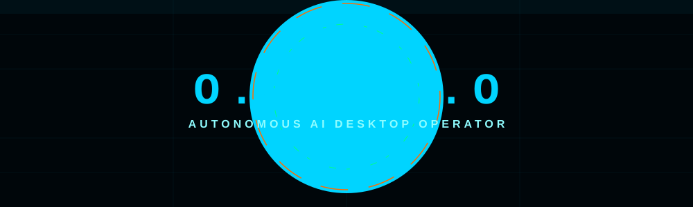
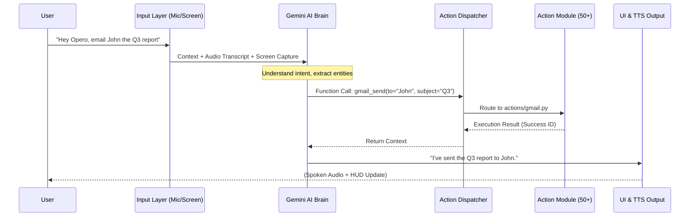
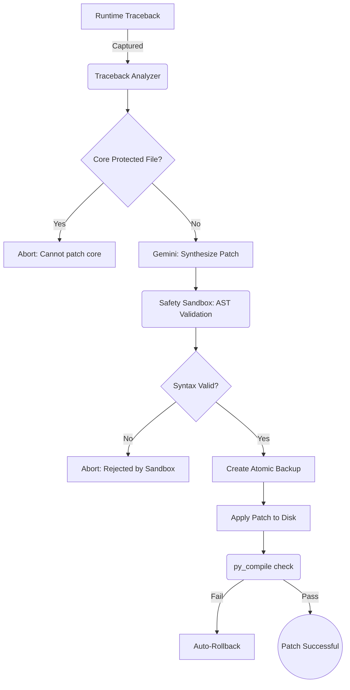

# <div align="center">

**📧** [channallikrishnasai@gmail.com](mailto:channallikrishnasai%40gmail.com) &nbsp;&nbsp;|&nbsp;&nbsp; **🔗** [LinkedIn](https://www.linkedin.com/in/krishna-sai-channalli-4528262b3)

```text
 ██████╗ ██████╗ ███████╗██████╗  ██████╗
██╔═══██╗██╔══██╗██╔════╝██╔══██╗██╔═══██╗
██║   ██║██████╔╝█████╗  ██████╔╝██║   ██║
██║   ██║██╔═══╝ ██╔══╝  ██╔══██╗██║   ██║
╚██████╔╝██║     ███████╗██║  ██║╚██████╔╝
 ╚═════╝ ╚═╝     ╚══════╝╚═╝  ╚═╝ ╚═════╝
```



**Open Personal Execution & Response Operator**
*Your desktop. Your AI. Fully autonomous.*

[](https://python.org)
[](https://pypi.org/project/PyQt6/)
[](https://deepmind.google/technologies/gemini/)
[](LICENSE)

[🚀 Quick Start](#-quick-start) · [🤖 Automations](#-autonomous-modules--capabilities) · [🔀 Architecture](#-architecture--pipeline) · [🔧 Setup](#-setup--configuration) · [🤝 Connect](#-connect)

</div>

---

## 🌟 What is OPERO?

**OPERO** is a multi‑modal, local‑first living AI assistant and dynamic desktop operating system powered by **Google Gemini**. It sees your screen, hears your voice, understands your intent, and executes real actions on your computer autonomously.

Unlike traditional chatbots, OPERO is an **action engine** – it **does** the work for you.

---

## 🔀 Architecture & Pipeline

### Core Flow (Mermaid)


### System Layer Diagram (SVG)
<div align="center">
  
</div>

---

## 🤖 Autonomous Modules & Capabilities

OPERO ships with **50+ Action Modules**. Click any category to explore the automations.

<details>
<summary><b>🛡️ 1️⃣ Self‑Heal Engine</b></summary>

Detects runtime errors, generates Gemini patches, validates with an AST sandbox, and auto‑rolls back if needed.


</details>

<details>
<summary><b>📧 2️⃣ Gmail Automation</b></summary>

Fully integrated OAuth2/App‑Passcode email engine.
- **Read & Search** – "Find the email from my boss about the Q3 report."
- **Draft & Send** – "Reply saying I will have it done by 5 PM."
- **Summarize** – "Summarize my unread emails today."
</details>

<details>
<summary><b>🌐 3️⃣ Live Web Research</b></summary>

DuckDuckGo + Gemini powered instant research.
- **Compare** – "Compare iPhone 15 vs Galaxy S24."
- **News** – "Top tech headlines today."
- **Scrape** – Structured data extraction from live pages.
</details>

<details>
<summary><b>📝 4️⃣ Document & Media Generation</b></summary>

Create rich files locally.
- **Word (.docx)** – Project proposals.
- **PowerPoint (.pptx)** – AI‑generated decks.
- **PDF** – Formatted reports.
- **HTML/CSS** – Landing pages.
</details>

<details>
<summary><b>🎵 5️⃣ Spotify Voice Control</b></summary>

Hands‑free music management via the Spotify Web API.
- Play, pause, skip, add to playlist.
</details>

<details>
<summary><b>💻 6️⃣ Full Desktop & File System Control</b></summary>

Orchestrate your PC with PyAutoGUI and OS utilities.
- Move/rename files, UI clicks, system monitoring.
</details>

<details>
<summary><b>🔍 7️⃣ Stanford MOSS Plagiarism Detection</b></summary>

Upload source code to MOSS, receive similarity matrix & web report URL.
</details>

---

## 📊 Feature Matrix

| **Module Category** | **Example Files** | **Inputs** | **Outputs** |
|---------------------|-------------------|------------|-------------|
| System Control      | `computer_control.py`, `system_manager.py` | Voice, Text | Mouse/Keyboard events, Settings changes |
| Media & Audio       | `spotify_controller.py`, `youtube_video.py` | Voice | Audio playback, Spotify API triggers |
| File Processing     | `file_controller.py`, `file_processor.py` | File paths, NL description | Moved/renamed files, OCR text, extracted data |
| Document Generation | `docx_tools.py`, `ppt_builder.py`, `pdf_tools.py` | Topic, content guidelines | `.docx`, `.pptx`, `.pdf` |
| Web & Research      | `web_search.py`, `browser_control.py` | Search queries, URLs | JSON summaries, Markdown reports |
| Communication       | `gmail.py`, `instagram_mcp.py` | Credentials, draft content | Sent emails, Direct messages |
| Self‑Healing        | `auto_heal_engine.py`, `recovery.py` | Tracebacks, exceptions | AST‑validated `.py` patches |

---

## 🚀 Quick Start

### 1️⃣ Prerequisites
- **Python 3.10+** (Windows 10/11 recommended)
- **Microphone & Speakers**
- **Google Gemini API Key** – obtain from the [Gemini AI Studio](https://deepmind.google/technologies/gemini/).

### 2️⃣ Installation
```bash
# Clone the repo
git clone https://github.com/channallikrishnasai/The-Opero.git
cd The-Opero

# (Optional) create a virtual env
python -m venv venv && .\venv\Scripts\activate

# Install dependencies
pip install -r requirements.txt
```

### 3️⃣ Configuration
Place your secret keys in `config/api_keys.json`:
```json
{
  "gemini": "YOUR_GEMINI_API_KEY",
  "gmail": {
    "client_id": "...",
    "client_secret": "...",
    "refresh_token": "..."
  },
  "spotify": {
    "client_id": "...",
    "client_secret": "..."
  }
}
```
> **Tip:** The UI includes a Settings overlay where you can paste the Gemini key directly.

### 4️⃣ Run OPERO
```bash
python main.py
```
The desktop HUD will appear, embedding the interactive **`site/index.html`** dashboard.

---

## 🔧 Verification & Testing
| **Subsystem** | **Command** | **Expected Result** |
|---------------|-------------|---------------------|
| Core Boot | `python -c "import main; print('OK')"` | No import errors |
| Action Loader | `python -c "from core.action_loader import discover_actions; discover_actions(None)"` | 50+ actions discovered |
| Gmail OAuth | `python -c "from actions.gmail import execute; print(execute({'action':'status'}))"` | Shows active token status |
| Self‑Heal Demo | `python demo/demo_selfheal.py` | Runs 3 auto‑repair cycles |
| UI Load | Open `http://localhost:8000/site/` (or run `main.py`) | 3D galaxy background, interactive cards |

---

## 🖼️ UI Highlights (Live Demo)
<div align="center">
  
  
</div>

- **Full‑screen 3D galaxy** built with Three.js – stars, nebulae, floating geometry.
- **Custom neon cursor** with interactive halo.
- **Feature cards** tilt on mouse hover (desktop) and pop‑out on tap (mobile).
- **Scroll progress bar** at the top.
- **Mini‑mode (F10)** – shrinks HUD to a floating avatar that stays on top.
- **Live HUD** updates via Gemini responses (voice & text).

---

## 🤝 Connect & Contribute
<div align="center">

**Built by [Krishna Sai Channalli](https://www.linkedin.com/in/krishna-sai-channalli-4528262b3)**

[](https://github.com/channallikrishnasai/The-Opero)
[](https://www.linkedin.com/in/krishna-sai-channalli-4528262b3)
[](https://github.com/channallikrishnasai/The-Opero/issues)

</div>

- 🐛 **Found a bug?** Open an issue.
- 💡 **Feature request?** Start a discussion.
- 🤝 **Pull requests** are warmly welcome – see `CONTRIBUTING.md` for guidelines.

---

<div align="center">

Made with ❤️ in India 🇮🇳

**[⭐ Star this repo](https://github.com/channallikrishnasai/The-Opero) if OPERO made your day easier!**

</div>
